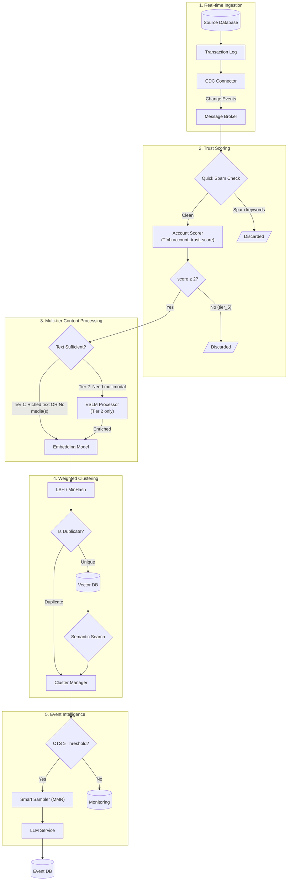
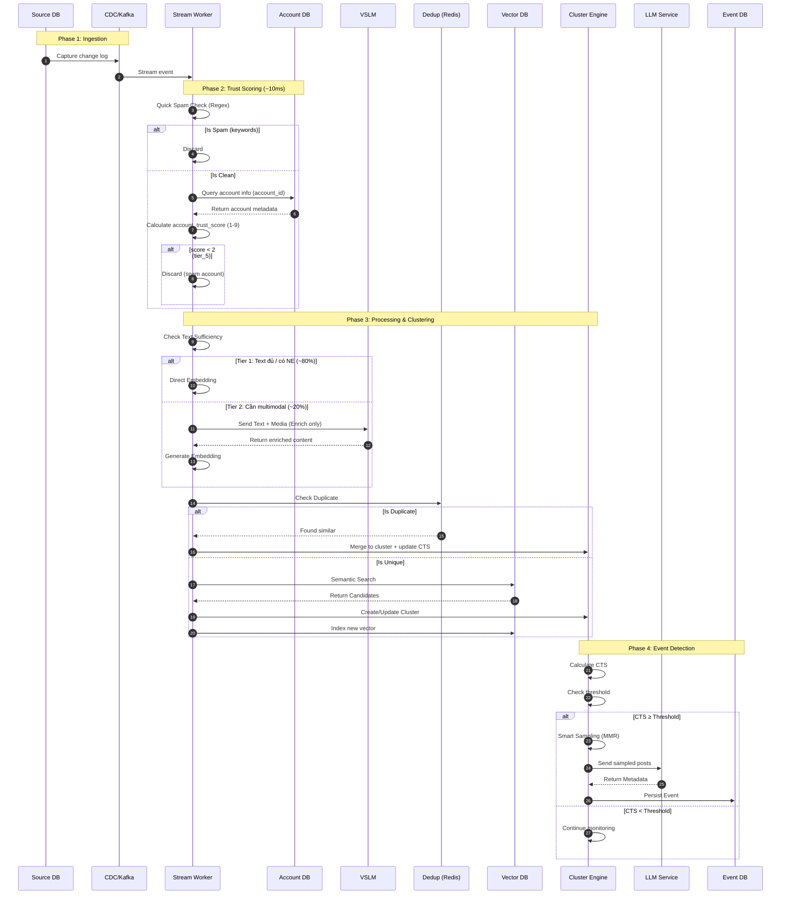
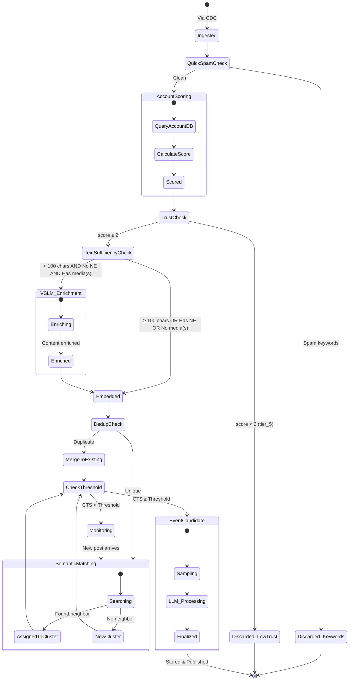
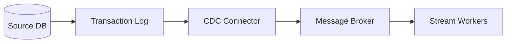
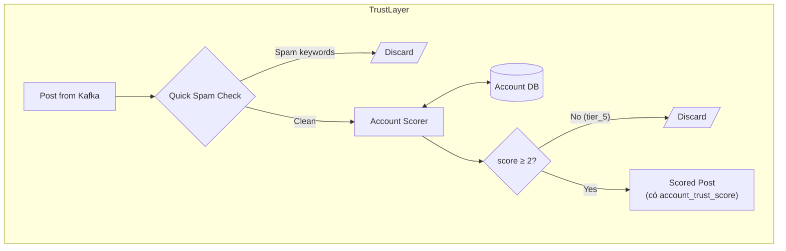
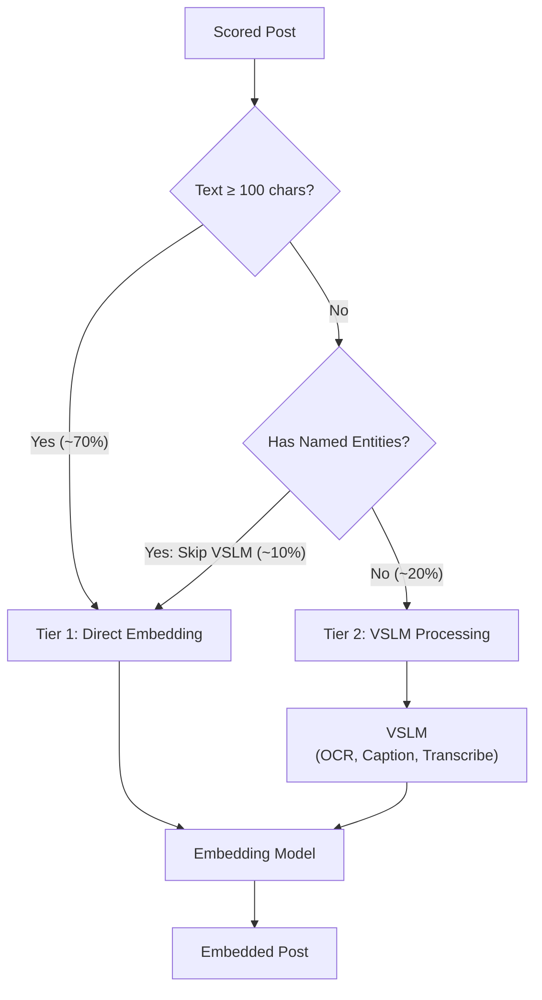
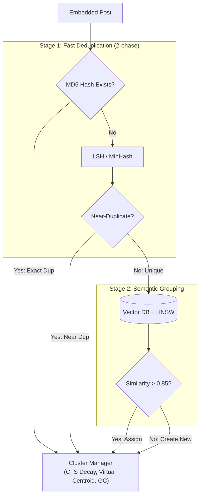
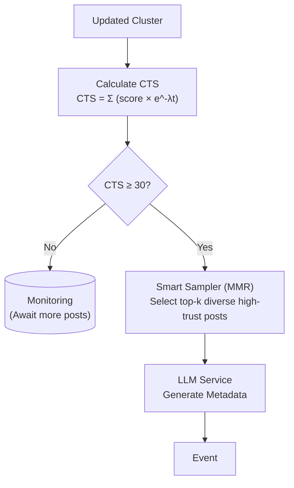

# System Design - Social Event Detector

## 1. Bài toán

### 1.1 Bối cảnh & Vấn đề

Trong thời đại bùng nổ thông tin, mạng xã hội trở thành nguồn tin tức nhanh nhất về các sự kiện đang diễn ra. Mỗi ngày, hàng triệu bài viết được đăng tải trên các nền tảng như Facebook, TikTok, X (Twitter), và các trang báo chí điện tử.

**Vấn đề cần giải quyết:**

- Phát hiện tự động các **sự kiện nổi bật** (hot events/trending topics) từ dòng dữ liệu mạng xã hội liên tục
- Đảm bảo phát hiện kịp thời (near real-time) với độ trễ chấp nhận được
- Loại bỏ nhiễu, nhóm các bài viết liên quan về cùng một sự kiện
- Tự động sinh metadata có ý nghĩa cho mỗi sự kiện được phát hiện

### 1.2 Yêu cầu chức năng (Functional Requirements)

| #    | Yêu cầu                  | Mô tả                                                           |
| ---- | ------------------------ | --------------------------------------------------------------- |
| FR-1 | **Ingestion**            | Hệ thống phải lấy dữ liệu từ DB nguồn                           |
| FR-2 | **Content Processing**   | Xử lý nội dung text, hình ảnh & video                           |
| FR-3 | **Similarity Detection** | Phát hiện các bài viết có nội dung tương tự                     |
| FR-4 | **Clustering**           | Nhóm các bài viết tương tự thành cluster                        |
| FR-5 | **Event Detection**      | Xác định cluster đủ điều kiện trở thành Event                   |
| FR-6 | **Metadata Generation**  | Tự động sinh tên, tóm tắt, keywords, hashtags cho Event         |
| FR-7 | **Event Update**         | Cập nhật Event khi có bài viết mới thuộc cùng chủ đề            |
| FR-8 | **Data Persistence**     | Ghi Events và Posts vào Database để downstream systems truy cập |

### 1.3 Yêu cầu phi chức năng (Non-Functional Requirements)

| Yêu cầu               | Metric                                                | Target             |
| --------------------- | ----------------------------------------------------- | ------------------ |
| **Throughput**        | Posts processed/day                                   | ≥ 1,000,000        |
| **Detection Latency** | Thời gian từ khi đủ điều kiện đến khi phát hiện Event | ≤ 2 giờ            |
| **Accuracy**          | Event detection precision                             | ≥ 85%              |
| **Scalability**       | Khả năng scale theo volume                            | Horizontal scaling |

### 1.4 Input Specification

**Nguồn dữ liệu:** Database  
**Volume:** ~1,000,000 bài viết/ngày  
**Cơ chế lấy dữ liệu:** CDC (Change Data Capture) stream

**Cấu trúc bài viết đầu vào giả định từ db source (Post):**

| Field          | Type                     | Description                    | Required |
| -------------- | ------------------------ | ------------------------------ | -------- |
| `content`      | string                   | Nội dung bài viết              | Yes      |
| `title`        | string (nullable)        | Tiêu đề (nếu có)               | No       |
| `medias`       | array[string] (nullable) | URLs/paths hình ảnh hoặc video | No       |
| `posted_at`    | datetime                 | Thời gian đăng tải             | Yes      |
| `account_id`   | string                   | ID tài khoản đăng tải          | Yes      |
| `account_name` | string                   | Tên tài khoản                  | Yes      |
| `source`       | string                   | Nguồn (FB, TikTok, X, News)    | Yes      |
| `url`          | string                   | Link bài viết gốc              | Yes      |

### 1.5 Output Specification

**Định nghĩa sự kiện nổi bật (Event):**

> **Yêu cầu ban đầu (Quantity-based)**: Event = ≥5 posts từ ≥5 accounts.

**Cấu trúc Event đầu ra:**

| Field                    | Type                     | Description                                               | Required |
| ------------------------ | ------------------------ | --------------------------------------------------------- | -------- |
| `event_name`             | string                   | Tên sự kiện (auto-generated)                              | Yes      |
| `summary`                | string                   | Tóm tắt nội dung sự kiện                                  | Yes      |
| `keywords`               | array[string]            | Các từ khóa chính                                         | Yes      |
| `hashtags`               | array[string] (nullable) | Hashtags liên quan                                        | No       |
| `suggested_keywords`     | array[string]            | Từ khóa gợi ý để mở rộng tìm kiếm                         | Yes      |
| `main_participants`      | array[string] (nullable) | Người/tổ chức tham gia chính                              | No       |
| `location`               | string                   | Địa điểm xảy ra sự kiện                                   | Yes      |
| `timeline`               | array[dict]              | Timeline mô tả sự kiện                                    | Yes      |
| `category`               | string                   | Chủ đề: Kinh tế, Chính trị, Trật tự xã hội, Giải trí, ... | Yes      |
| `posts`                  | array[Post]              | Danh sách bài viết thuộc sự kiện                          | Yes      |
| `cumulative_trust_score` | float                    | Tổng điểm tin cậy CTS (**dynamic**, có Time Decay)        | Yes      |

**Ví dụ:**

```json
{
  "event_name": "Bão số 9 đổ bộ miền Trung Việt Nam",
  "summary": "Bão số 9 với sức gió cấp 12-13 đã đổ bộ vào các tỉnh Quảng Nam, Quảng Ngãi vào sáng 29/12. Hàng nghìn hộ dân được sơ tán, nhiều khu vực bị ngập lụt nghiêm trọng.",
  "keywords": ["bão số 9", "miền Trung", "ngập lụt", "sơ tán"],
  "hashtags": ["#bao9", "#mienTrung", "#thientai"],
  "suggested_keywords": ["cứu trợ", "thiệt hại", "Quảng Nam", "Quảng Ngãi"],
  "main_participants": ["Ban chỉ đạo PCTT", "Quân đội", "Hội Chữ thập đỏ"],
  "location": "Quảng Nam, Quảng Ngãi, Việt Nam",
  "timeline": [
    {
      "time": "2024-12-29T06:00:00Z",
      "description": "Bão đổ bộ vào Quảng Nam"
    },
    {
      "time": "2024-12-29T08:30:00Z",
      "description": "Nhiều khu vực bị ngập sâu 1-2m"
    },
    {
      "time": "2024-12-29T10:00:00Z",
      "description": "Ban bố tình trạng khẩn cấp"
    }
  ],
  "category": "Thiên tai",
  "posts": [
    {
      "content": "Bão số 9 đã đổ bộ vào Quảng Nam lúc 6h sáng nay, gió giật cấp 12-13. Người dân cần ở trong nhà an toàn.",
      "title": "KHẨN: Bão số 9 đổ bộ",
      "medias": ["https://example.com/img/bao9_1.jpg"],
      "posted_at": "2024-12-29T06:15:00Z",
      "account_id": "vtv_news",
      "account_name": "VTV News",
      "source": "FB",
      "url": "https://facebook.com/vtv/posts/123456"
    },
    {
      "content": "Cập nhật: Quảng Ngãi ngập sâu 1-2m, hàng trăm hộ dân được sơ tán khẩn cấp #bao9 #mienTrung",
      "title": null,
      "medias": [
        "https://example.com/img/ngaplut.jpg",
        "https://example.com/video/sotandc.mp4"
      ],
      "posted_at": "2024-12-29T08:45:00Z",
      "account_id": "tuoitre_online",
      "account_name": "Tuổi Trẻ Online",
      "source": "FB",
      "url": "https://facebook.com/tuoitre/posts/789012"
    }
  ],
  "cumulative_trust_score": 45.2
}
```

### 1.6 Scope

**In-scope:**

- Hình thành Event từ điều kiện đã định nghĩa
- Cập nhật bài viết mới vào Event đã tồn tại
- Lưu trữ Events và Posts

## 2. Mô hình đề xuất: Trust-weighted Detection

> **Lý do đề xuất**: Yêu cầu ban đầu (≥5 posts từ ≥5 accounts) dễ bị thao túng bởi chiến dịch seeding/botnet. Mô hình Trust-weighted giúp đảm bảo chất lượng Event.

### 2.1 Thay đổi so với yêu cầu ban đầu

| Aspect             | Yêu cầu ban đầu (Quantity-based) | Đề xuất (Trust-weighted)          |
| ------------------ | -------------------------------- | --------------------------------- |
| **Event Trigger**  | ≥5 posts từ ≥5 accounts          | CTS ≥ 30 (Cumulative Trust Score) |
| **Anti-seeding**   | Không có                         | Có - chống thao túng hiệu quả     |
| **Quality Signal** | Không phân biệt nguồn            | Ưu tiên nguồn uy tín              |

### 2.2 Ví dụ so sánh kích hoạt Event (score range 1-10)

> **Lưu ý:** Các ví dụ dưới đây tính toán **giản lược tại thời điểm tức thời** (instantaneous), chưa bao gồm hệ số suy giảm theo thời gian (Time Decay) được mô tả chi tiết ở mục 4.5.1.

| Scenario                 | Posts    | Calculation | CTS | Quantity-based     | Trust-weighted           |
| ------------------------ | -------- | ----------- | --- | ------------------ | ------------------------ |
| 2 báo lớn + 2 KOLs       | 4 posts  | 2×9 + 2×7   | 32  | ❌ Chưa đủ 5 posts | ✅ Trigger               |
| 50 nick ảo (tier_5)      | 50 posts | 50×1        | 50  | ✅ Trigger (sai)   | ✅ Trigger (nhưng delay) |
| 6 users lâu năm (tier_3) | 6 posts  | 6×5         | 30  | ✅ Trigger         | ✅ Trigger               |
| 3 users mới + 2 bots     | 5 posts  | 3×3 + 2×1   | 11  | ✅ Trigger (sai)   | ❌ Blocked               |
| 4 tier_4 accounts        | 4 posts  | 4×3         | 12  | ❌ Chưa đủ 5 posts | ❌ Blocked               |

## 3. Kiến trúc hệ thống

### 3.1 High-level Architecture



### 3.3 Sequence Diagram



### 3.4 State Diagram



### 3.5 Định nghĩa các thuật ngữ

| Thuật ngữ                            | Định nghĩa                                                                                      |
| ------------------------------------ | ----------------------------------------------------------------------------------------------- |
| **CTS (Cumulative Trust Score)**     | Tổng điểm tin cậy của cluster **với Time Decay**. Công thức: `CTS = Σ (score × e^-λt)`          |
| **account_trust_score**              | Điểm tin cậy của tài khoản (1-9), **tính runtime** bởi Account Scorer dựa trên account metadata |
| **Tier**                             | Phân loại độ uy tín của tài khoản nguồn (1-5), mỗi tier có score tương ứng (9, 7, 5, 3, 1)      |
| **Account Scorer**                   | Component tính `account_trust_score` dựa trên điều kiện phân loại tier (xem 1.4)                |
| **Cluster**                          | Nhóm các bài viết có nội dung liên quan đến cùng một chủ đề/sự kiện                             |
| **Virtual Centroid**                 | Vector trung bình của top-k posts (k=5) đại diện cho cluster trong semantic search              |
| **Event**                            | Cluster đã đạt ngưỡng CTS ≥ 30 và được sinh metadata bởi LLM                                    |
| **MMR (Maximal Marginal Relevance)** | Thuật toán lấy mẫu đảm bảo đa dạng và chất lượng                                                |
| **VSLM**                             | Vision-Small Language Model (Tier 2 only)                                                       |

---

## 4. Đặc tả kỹ thuật các thành phần

### 4.1 Layer 1: Ingestion



**Mô tả:**

- Lắng nghe log thay đổi (binlog/WAL) từ DB nguồn
- Đảm bảo độ trễ thấp (<1s) và không làm tăng tải cho DB query
- Message buffer chịu tải cao, decouple tốc độ ingest và xử lý

**Lý do chọn CDC thay vì Polling:**

- Độ trễ thấp hơn (milliseconds vs seconds)
- Không tăng tải DB
- Đảm bảo không miss data

**Tech Stack đề xuất:**

| Component      | Công nghệ    | Lý do                                |
| -------------- | ------------ | ------------------------------------ |
| CDC Connector  | Debezium     | Open-source, mature, hỗ trợ nhiều DB |
| Message Broker | Apache Kafka | High throughput, fault-tolerant      |

---

### 4.2 Layer 2: Trust Scoring



**Mô tả:**
Layer này tính `account_trust_score` và lọc bỏ spam accounts.

#### 4.2.1 Spam Detection (Regex)

**Quick Regex Filter** (< 1ms):

- Các keywords: cờ bạc, sex, scam, lending, phishing URLs
- Drop ngay lập tức nếu match

#### 4.2.2 Account Scorer

**Mục đích:** Tính `account_trust_score` dựa trên account metadata từ Account DB.

### Bảng Tổng Hợp Logic Phân Loại & Tính Điểm Account (Tier Scoring)

| Thứ tự ưu tiên |    Tier     | Score | Điều kiện Logic (Technical Condition)                   | Mô tả & Loại tài khoản                                                                   | Ví dụ                       |
| :------------- | :---------: | :---: | :------------------------------------------------------ | :--------------------------------------------------------------------------------------- | :-------------------------- |
| **1**          |    **1**    | **9** | `account_id` ∈ **Official List** (human-defined)        | **Nguồn chính thống**: Các tài khoản được con người xác thực thủ công là uy tín/báo chí. | VTV, Tuổi Trẻ, VnExpress    |
| **2**          |    **2**    | **7** | `followers` ≥ 10,000 **OR** `is_verified` is True       | **High Profile**: KOL, tài khoản có tích xanh hoặc trang cộng đồng lớn.                  | Influencers, Journalists    |
| **3**          |    **5**    | **1** | `posts_per_day` > 3 _(Áp dụng khi không lọt Tier 1, 2)_ | **Spam/Bot**: Tài khoản thường nhưng tần suất đăng bài bất thường.                       | Spam accounts, Seeding bots |
| **4**          |    **4**    | **3** | `account_age` < 3 months                                | **New User**: Người dùng mới, chưa đủ lịch sử để đánh giá độ tin cậy.                    | Tài khoản mới tạo           |
| **5**          |    **3**    | **5** | `account_age` > 2 years **AND** `last_active` < 1 week  | **Trustworthy User**: Người dùng lâu năm và vẫn còn hoạt động gần đây.                   | Long-term users             |
| **6**          | **Default** | **3** | **ELSE** (Không thỏa mãn các điều kiện trên)            | **Normal User**: Người dùng thông thường, vãng lai hoặc không đủ dữ liệu đặc biệt.       | -                           |

**Trust Check:**

- Nếu `score < 2` (tier_5) → Discard (spam account)
- Ngược lại → Tiếp tục xử lý

**Event Trigger:** CTS ≥ 30

**Tech Stack đề xuất:**

| Component      | Công nghệ          | Lý do                  |
| -------------- | ------------------ | ---------------------- |
| Account DB     | Redis / PostgreSQL | Lưu account metadata   |
| Spam Filter    | Regex (Python re)  | Extremely fast (<1ms)  |
| Account Scorer | Python logic       | Đơn giản, dễ customize |

---

### 4.3 Layer 3: Processing



**Mô tả:**
Layer xử lý nội dung bài viết với chiến lược Multi-tier để tối ưu hiệu năng.

#### 4.3.1 Multi-tier Processing Strategy

**Nguyên lý:** Không phải bài viết nào cũng cần xử lý multimodal. Nếu text đã đủ thông tin, không cần tốn resource cho VSLM.

| Tier       | Điều kiện                                   | Xử lý                     |
| ---------- | ------------------------------------------- | ------------------------- |
| **Tier 1** | Text ≥ 100 chars **HOẶC** có Named Entities | Direct Embedding          |
| **Tier 2** | Text < 100 chars, không có NE, có media     | VSLM → Enrichment → Embed |

- **NER Skip Logic:** Nếu text ngắn nhưng chứa Named Entities (địa danh, tên riêng, tổ chức) rõ ràng → Skip VSLM, dùng Text Embedding trực tiếp.
- **Lý do:** Giảm ~50% lượng call VSLM, tiết kiệm GPU cost hoặc API cost và latency.

**Format `formatted_text` input vào embedding model (để chuẩn hoá với VSLM)**

```text
[TITLE] <Title>
[CONTENT] <Content>
```

#### 4.3.2 VSLM Processor (Tier 2 only)

**Mục đích:** Trích xuất thông tin từ media (ảnh/video) để **làm giàu nội dung**.

**Nhiệm vụ:**

- Giải thích visual component trong ảnh/video
- OCR text có trong ảnh/video
- Tóm tắt video theo keyframe
- Transcribe âm thanh từ video

**Format `enriched_text` input text vào embedding model:**

```text
[TITLE] <Title>
[CONTENT] <Content>
[MEDIA_IMAGE] <image_description>
[MEDIA_VIDEO] <video_summary>
[MEDIA_VIDEO_AUDIO] <audio_transcript>
```

#### 4.3.3 Embedding Generation

**Mục đích:** Chuyển đổi text thành dense vector để so sánh semantic similarity.

**Input:** `enriched_text` (Tier 2) hoặc `formatted_text` (Tier 1)

**Output:** Dense vector

**Tech Stack đề xuất:**

| Component | Công nghệ                                   |
| --------- | ------------------------------------------- |
| VSLM      | Omni VSLM API (VSLM hệ omni để xử lý audio) |
| Embedding | `bge-m3` tốt nhất cho tiếng việt            |

---

### 4.4 Layer 4: Clustering



**Mô tả:**
Layer gom nhóm bài viết với kiến trúc Two-Stage để tối ưu performance.

#### 4.4.1 Stage 1: Fast Deduplication (Two-phase)

**Mục tiêu:** Loại bỏ bài viết trùng lặp hoàn toàn hoặc gần hoàn toàn (copy-paste).

**Phase 1: Exact Deduplication (Pre-LSH Check)**

- **Kỹ thuật:** MD5/SHA256 hash của `content` field
- **Latency:** O(1) lookup (~0.1ms)
- **Mục đích:** Loại bỏ bài copy-paste y hệt (thường gặp ở seeding campaigns)
- **Storage:** Redis SET với hash làm key

```
hash = MD5(normalize(content))  // lowercase, remove extra spaces
if EXISTS(hash) -> Merge to existing cluster
else SET(hash, post_id, TTL=24h) -> Continue to LSH
```

**Phase 2: Near-Duplicate Detection (LSH)**

- **Kỹ thuật:** MinHash LSH (Locality Sensitive Hashing)
- **Latency:** ~5ms
- **Mục đích:** Phát hiện bài viết gần giống (paraphrase, slight modifications)

**Tác dụng tổng hợp:**

- Giảm tải cho Vector DB
- Xử lý cực nhanh (O(1) + O(1) lookup)
- Phát hiện cả exact và near-duplicate

**Lý do 2-phase:** Hash check nhanh hơn LSH (~0.1ms vs ~5ms), loại bỏ exact duplicate trước khi vào xử lý phức tạp hơn.

#### 4.4.2 Stage 2: Semantic Grouping

**Mục tiêu:** Gom nhóm các bài viết có _cùng ý nghĩa_ nhưng _khác câu chữ_.

**Kỹ thuật:** HNSW (Hierarchical Navigable Small World) trong Vector DB

**Threshold:** Cosine Similarity > 0.85

**Payload:** Mỗi vector lưu kèm `trust_score` để dùng cho CTS calculation.

#### 4.4.3 Cluster Manager

**Nhiệm vụ:**

1. Quản lý các cluster và posts thuộc về cluster
2. Cập nhật CTS (với Time Decay) mỗi khi có post mới
3. Tính Virtual Centroid cho semantic search
4. Garbage Collection cho stale clusters

**Virtual Centroid:**

| Aspect          | Thiết kế cũ                        | Thiết kế mới (Virtual Centroid)        |
| --------------- | ---------------------------------- | -------------------------------------- |
| Centroid        | Bài có trust_score cao nhất        | Vector trung bình của top-k high-trust |
| Semantic Search | Dựa trên 1 bài (có thể thiên lệch) | Đại diện tốt hơn cho toàn cluster      |
| LLM Input       | Gửi 1 bài centroid                 | Gửi k bài đa dạng (MMR sampling)       |

**Công thức Virtual Centroid:**

```
virtual_centroid = mean(vectors of top-k posts by trust_score)
// k = min(5, cluster_size)
```

**Lý do:** Bài có trust_score cao nhất có thể nội dung quá ngắn hoặc thiên lệch. Virtual centroid đại diện cluster tốt hơn cho semantic search.

**Cluster Garbage Collection (TTL-based):**

- **Vấn đề:** "Bùng nổ" số lượng cluster rác không bao giờ đạt ngưỡng Event, gây tốn tài nguyên.
- **Giải pháp:** TTL = 24h cho các Cluster chưa đạt ngưỡng Event.
- **Logic:**
  - Mỗi cluster có `last_updated_at` timestamp
  - Nếu `now - last_updated_at > 24h` AND `CTS < threshold` → Xóa cluster + vectors liên quan
  - Clusters đã thành Event được giữ lâu hơn (TTL = 7 ngày hoặc manual)

**Tech Stack đề xuất:**

| Component        | Công nghệ       | Lý do                          |
| ---------------- | --------------- | ------------------------------ |
| Hash Storage     | Redis           | O(1) exact duplicate check     |
| LSH Storage      | Redis           | Fast SET operations            |
| Vector DB        | Qdrant / Milvus | HNSW support, payload indexing |
| Cluster Metadata | Redis           | Fast CTS updates, TTL for GC   |

---

### 4.5 Layer 5: Event Intelligence



**Mô tả:**
Layer phát hiện Event và sinh metadata với cơ chế Trust Score.

#### 4.5.1 CTS Calculation 

**Công thức CTS với Exponential Time Decay:**

```
CTS = Σ (account_trust_score_i × e^(-λ × t_i))

Trong đó:
- t_i = (now - posted_at_i) tính bằng giờ
- λ = decay rate = ln(2) / half_life
- half_life = 12 giờ (sau 12h, contribution giảm 50%)
```

**Ví dụ decay theo thời gian (score gốc = 9):**

| Thời gian | Decay Factor | Effective Score |
| --------- | ------------ | --------------- |
| 0h        | 1.00         | 9.0             |
| 6h        | 0.71         | 6.4             |
| 12h       | 0.50         | 4.5             |
| 24h       | 0.25         | 2.3             |
| 48h       | 0.06         | 0.5             |

**Phân tích ngưỡng 30 (với score range 1-9, fresh posts):**

```
30 = 4 × Tier1(9)      = 36  ✓
   = 5 × Tier2(7)      = 35  ✓
   = 6 × Tier3(5)      = 30  ✓
```

**Lợi ích Time Decay:**

- Ưu tiên sự kiện đang "nóng" (nhiều posts gần đây)
- Tự động "hạ nhiệt" các cluster cũ không còn active
- Chống việc cluster tích lũy score từ posts cũ để trigger sai

#### 4.5.2 Smart Sampler (MMR)

**Mục đích:** Chọn k bài viết tiêu biểu nhất cho LLM, đảm bảo đa dạng và chất lượng.

**Thuật toán:** Maximal Marginal Relevance với trust score priority

**MMR Formula:**

```
MMR = λ × Sim(post, centroid) + (1-λ) × trust_score_normalized - max(Sim(post, selected))
```

**Lý do dùng MMR:** Đảm bảo posts được chọn vừa relevant vừa đa dạng, tránh trùng lặp thông tin.

#### 4.5.3 LLM Service

**Nhiệm vụ:**

1. Summarization: Tóm tắt nội dung sự kiện
2. NER: Trích xuất thực thể (người, tổ chức, địa điểm)
3. Classification: Phân loại chủ đề
4. Timeline: Xây dựng timeline từ timestamps

**Input:** List các bài viết high-trust từ Sampler (sắp xếp theo trust_score giảm dần)

#### 4.5.4 Event Update Logic

**Re-generate metadata khi:**

1. CTS tăng > 20%
2. Số posts tăng > 30%
3. Có post từ Official source (Tier 1) mới

**Tech Stack đề xuất:**

| Component       | Công nghệ          | Lý do                       |
| --------------- | ------------------ | --------------------------- |
| Event Detection | Custom CTS Logic   | Simple threshold check      |
| Smart Sampler   | MMR Algorithm      | Diversity + Quality balance |
| LLM             | Gemini 3.0 Pro API | Cần model thông minh        |

---

### 4.6 Layer 6: Persistence

**Mô tả:**
Layer lưu trữ kết quả (Events, Posts, Clusters) để downstream systems truy cập.

**Data Stores:**

| Store    | Dữ liệu                  | Công nghệ đề xuất |
| -------- | ------------------------ | ----------------- |
| Event DB | Events với full metadata | MongoDB           |
| Cache    | Hot data, CTS values     | Redis             |

---

## 5. Phân tích Latency (ước tính)

### 5.1 Post Processing Latency

> Latency xử lý 1 post, tính từ khi **consume từ Kafka stream**

```mermaid
gantt
    title Latency Breakdown - Tier 1 (~220ms)
    dateFormat x
    axisFormat %Lms

    section Processing
    Kafka Consume   :0, 5
    Trust Scoring   :5, 20
    Text Check      :20, 25
    Embedding       :25, 125
    Clustering      :125, 220
```

```mermaid
gantt
    title Latency Breakdown - Tier 2 (~620ms)
    dateFormat x
    axisFormat %Lms

    section Processing
    Kafka Consume   :0, 5
    Trust Scoring   :5, 20
    Text Check      :20, 25
    VSLM            :25, 425
    Embedding       :425, 525
    Clustering      :525, 620
```





**Processing Path Latency:**

| Stage        | Scenario         | Path                                  | Latency |
| ------------ | ---------------- | ------------------------------------- | ------- |
| Quick Spam   | Spam detected    | Kafka → Regex → Discard               | < 5ms   |
| Exact Dup    | Copy-paste       | Kafka → Trust → Hash → Merge          | < 25ms  |
| Tier 1       | Text ≥ 100 chars | Kafka → Trust → Embed → Cluster       | < 220ms |
| Tier 1 (NER) | Short + NE       | Kafka → Trust → NER → Embed → Cluster | < 230ms |
| Tier 2       | Need VSLM        | Kafka → Trust → VSLM → Cluster        | < 620ms |
| Trigger      | Form Event       | ... → CTS ✓ → MMR → LLM → Save        | +5 sec  |

**Weighted Average (~220ms):**

```
Avg = (0.03 × 5) + (0.05 × 25) + (0.62 × 220) + (0.10 × 230) + (0.15 × 620) + (0.05 × 5000)
    ≈ 0.15 + 1.25 + 136.4 + 23 + 93 + 250
    ≈ 504 ms/post (bao gồm triggering posts)

Non-triggering avg ≈ 220 ms/post
```

### 5.2 Event Detection Latency

> Thời gian từ khi **sự kiện thực tế xảy ra** đến khi **hệ thống phát hiện và hình thành Event**

| Factor             | Latency      | Description                                    |
| ------------------ | ------------ | ---------------------------------------------- |
| Source Crawl Delay | Out-of-scope | Thời gian crawler thu thập bài vào Source DB   |
| CDC Ingestion      | < 1 sec      | Capture và stream vào Kafka                    |
| Trust Scoring      | < 20 ms      | Spam check + Profile query + Score calculation |
| Post Processing    | < 1 sec      | Xử lý content và gán vào cluster               |
| CTS Accumulation   | Variable     | Thời gian chờ CTS đạt ngưỡng                   |
| Event Formation    | < 6 sec      | MMR Sampling + LLM Metadata Generation         |

**Event Detection Scenarios (score range 1-9, threshold 30):**

| Scenario              | Sources                      | Calculation        | CTS | Detection Time    |
| --------------------- | ---------------------------- | ------------------ | --- | ----------------- |
| Viral (High Trust)    | 2 báo + 2 KOLs               | 2×9 + 2×7          | 32  | < 10 min          |
| Viral (Community)     | 6 users lâu năm (tier_3)     | 6×5                | 30  | < 20 min          |
| Trending (Mixed)      | 1 báo + 3 veteran + 1 tier_4 | 9 + 3×5 + 3        | 27  | < 1 hour          |
| Slow-burn (Organic)   | 10 tier_4 accounts           | 10×3               | 30  | < 2 hours         |
| **Seeding (BLOCKED)** | 50 tier_5 (bị loại từ đầu)   | N/A (filtered out) | 0   | **KHÔNG TRIGGER** |

### 5.3 Throughput Analysis

| Metric              | Value                             |
| ------------------- | --------------------------------- |
| Posts/day (target)  | 1,000,000                         |
| Posts/second (avg)  | ~11.6                             |
| Posts/second (peak) | ~35                               |
| Processing capacity | **~50 posts/sec** (headroom ~40%) |
| Worker replicas     | 3-5 (auto-scale based on lag)     |

> **Design Note:** Capacity được thiết kế cao hơn peak ~40% để tránh backpressure lag vào giờ cao điểm kéo dài. Kafka buffer giúp absorb burst nhưng không thay thế được sufficient processing capacity.
